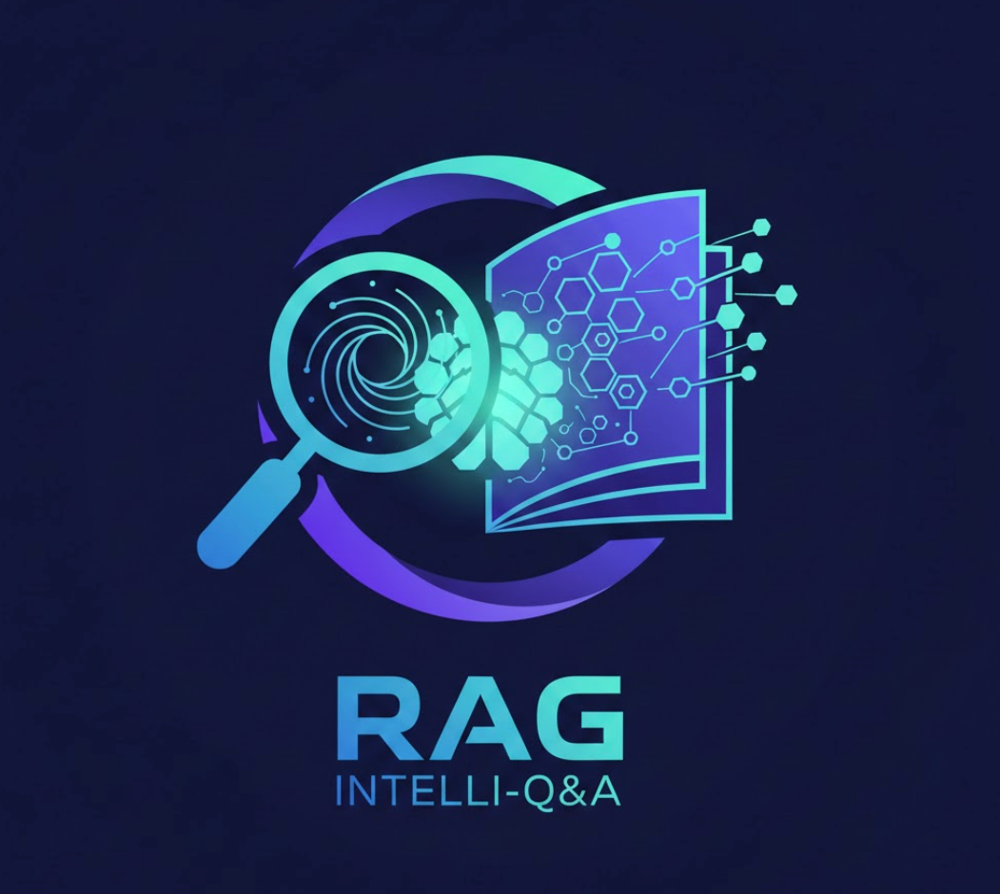
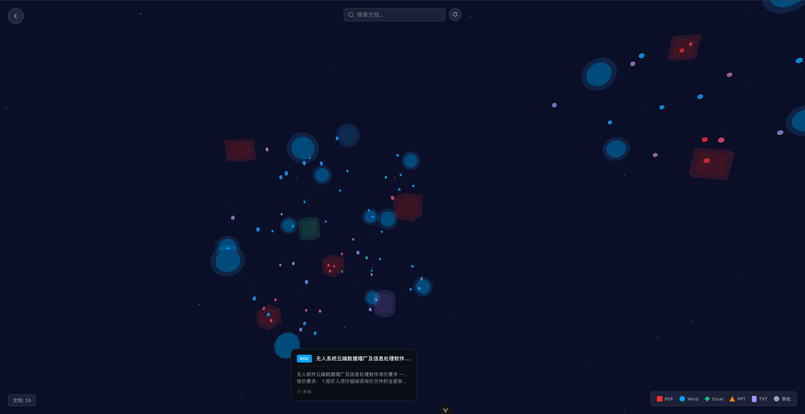
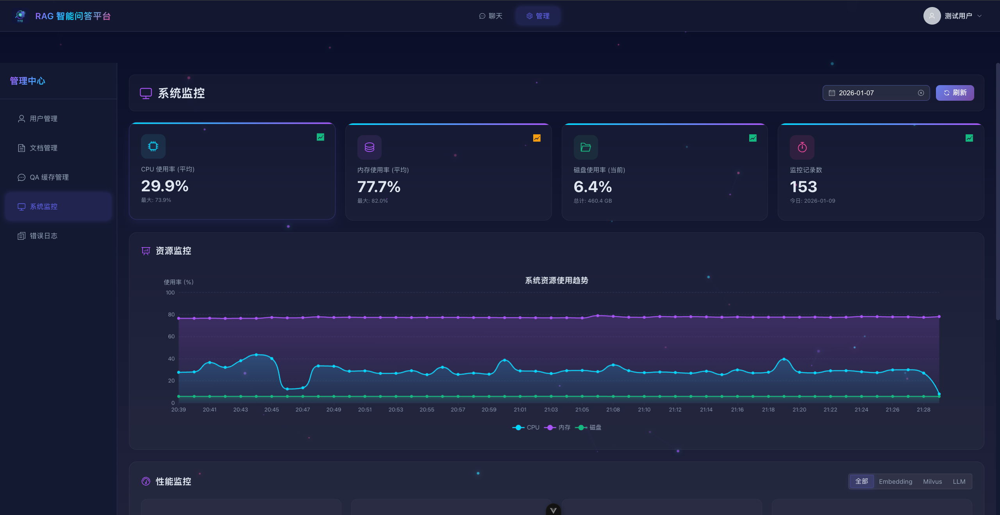

# RAG 智能问答系统

<div align="center">
  
  <h3>基于 RAG（检索增强生成）技术的企业级智能问答平台</h3>
  <p>支持多模态文档处理、实时流式对话和 MCP 工具集成</p>
</div>

## ✨ 核心特性

- 🚀 **真正的实时流式对话** - Token-by-Token 流式输出，Agent 推理过程可视化
- 🧠 **智能 ReAct Agent** - 真实工具调用，支持知识库检索、天气查询、路径规划等
- 📚 **企业级 RAG 检索** - 向量检索 + Reranker 重排序 + 智能去重
- 📄 **多模态文档处理** - 支持 PDF/Word/PPT/Excel，自动 OCR 识别，旧版格式智能转换
- 🖼️ **图像理解** - LLaVA 多模态分析 + Tesseract OCR 文字识别
- 🔐 **完整用户系统** - JWT 认证、权限控制、邮箱验证
- 🎨 **现代化前端** - Vue 3 + 暗色主题 + 粒子背景效果

## 🛠️ 技术栈

### 后端
- **框架**: FastAPI + uvicorn
- **数据库**: MongoDB (Beanie ODM) + Milvus (向量库) + Redis (缓存)
- **消息队列**: Kafka
- **AI/ML**: LangChain + LangGraph + Ollama + sentence-transformers
- **文档处理**: PyMuPDF + python-docx + pytesseract + LibreOffice

### 前端
- **框架**: Vue 3 + Composition API
- **状态管理**: Pinia
- **UI 组件**: Element Plus
- **样式**: 暗色主题 + Canvas 粒子效果



## 🚀 快速开始

### 环境要求
- Python 3.9+
- Node.js 16+
- Docker & Docker Compose
- Tesseract OCR
- LibreOffice (可选，用于旧版 Office 文档转换)

### 1. 克隆项目
```bash
git clone https://github.com/your-username/rag-platform.git
cd rag-platform
```

### 2. 安装依赖
```bash
# 后端依赖
pip install -r requirements.txt

# 前端依赖
cd web/plantform_vue
npm install
```

### 3. 启动数据库服务
```bash
# 启动 Milvus 向量数据库
cd milvus && docker-compose up -d

# 启动 MongoDB
cd mongodb && docker-compose up -d

# 启动 Redis
docker run -d --name redis -p 6379:6379 redis:alpine
```

### 4. 配置环境变量
```bash
cp env_template.txt .env
# 编辑 .env 文件，配置数据库连接等信息
```

### 5. 启动服务
```bash
# 启动后端服务
python main.py

# 启动前端服务
cd web/plantform_vue
npm run dev
```

访问 http://localhost:3000 开始使用！

## 📖 主要功能

### 🤖 智能对话
- **流式对话**: 实时 Token-by-Token 输出
- **Agent 推理**: 可视化思考过程 (Thought → Action → Observation)
- **工具调用**: 知识库检索、天气查询、POI 搜索、路径规划等
- **多模态**: 支持图片上传和分析

### 📚 文档管理
- **格式支持**: PDF、Word、PPT、Excel、图片等 15+ 种格式
- **智能处理**: 自动 OCR、旧版格式转换、表格识别
- **权限控制**: 管理员/普通用户文档权限分离
- **批量上传**: 支持拖拽和多文件上传

### 🔍 智能检索
- **三阶段检索**: 向量检索 → Reranker 重排序 → 智能去重
- **高质量 Embedding**: BGE-large-zh-v1.5 (1024维)
- **可溯源**: 返回引用文档和相关性评分

### 👥 用户系统
- **多种登录**: 昵称密码 / 邮箱验证码
- **安全认证**: bcrypt 密码加密 + JWT Token
- **权限管理**: 基于角色的文档访问控制

## 🏗️ 项目结构

```
├── api/                    # API 控制器
├── internal/               # 核心业务逻辑
│   ├── agent/             # ReAct Agent 实现
│   ├── db/                # 数据库连接 (MongoDB/Milvus/Redis)
│   ├── llm/               # LLM 服务
│   ├── rag/               # RAG 检索服务
│   └── service/           # 业务服务层
├── pkg/                   # 工具包
│   ├── agent_tools_mcp/   # MCP 工具集成
│   ├── model_list/        # 模型管理
│   └── utils/             # 工具函数
├── web/plantform_vue/     # Vue 3 前端
├── test/                  # 测试用例
└── main.py               # 应用入口
```

## 🔧 配置说明

### 环境变量 (.env)
```bash
# 数据库配置
MONGODB_URL=mongodb://localhost:27017
MILVUS_HOST=localhost
MILVUS_PORT=19530
REDIS_HOST=localhost
REDIS_PORT=6379

# LLM 配置
DEEPSEEK_API_KEY=your_api_key
OLLAMA_BASE_URL=http://localhost:11434

# 邮件服务
SMTP_SERVER=smtp.gmail.com
SMTP_PORT=587
SMTP_USERNAME=your_email
SMTP_PASSWORD=your_password

# JWT 密钥
JWT_SECRET_KEY=your_secret_key
```

## 📊 API 文档

启动服务后访问：
- **Swagger UI**: http://localhost:8000/docs
- **ReDoc**: http://localhost:8000/redoc

主要 API 端点：
- `POST /messages` - 发送消息（支持流式响应）
- `POST /documents` - 上传文档
- `GET /sessions` - 获取会话列表
- `POST /auth/login` - 用户登录

## 🧪 测试

```bash
# 运行完整 RAG 测试
python test/test_full_rag_qa.py

# 测试流式 API
python test/test_message_api.py

# 测试文档处理
python test/test_document_api.py
```

## 🤝 贡献

欢迎提交 Issue 和 Pull Request！

## 📄 许可证

MIT License

## 🙏 致谢

- [LangChain](https://github.com/langchain-ai/langchain) - LLM 应用框架
- [Milvus](https://github.com/milvus-io/milvus) - 向量数据库
- [FastAPI](https://github.com/tiangolo/fastapi) - 现代 Python Web 框架
- [Vue.js](https://github.com/vuejs/vue) - 渐进式 JavaScript 框架