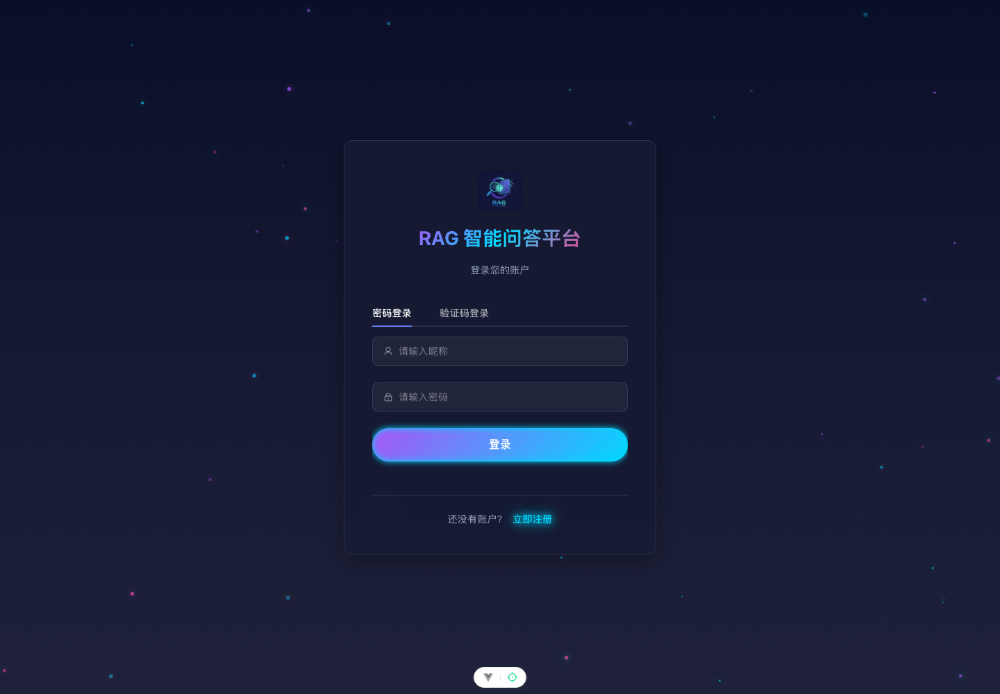
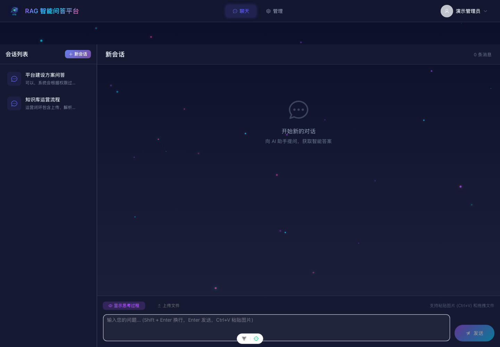
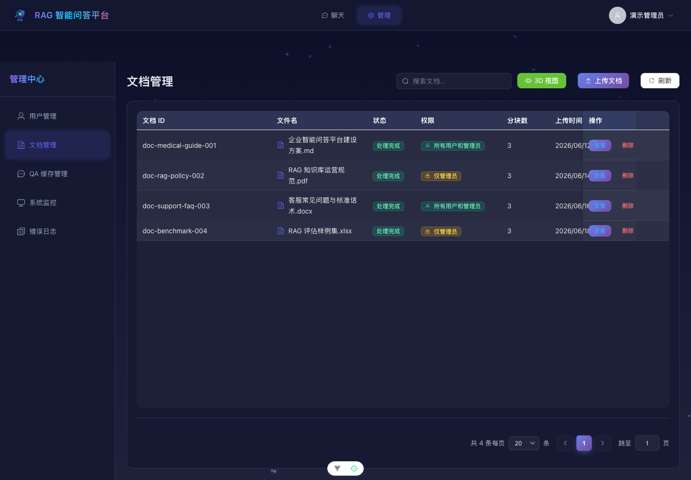
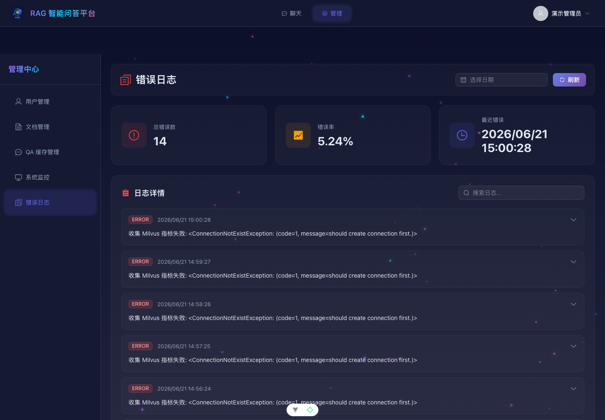
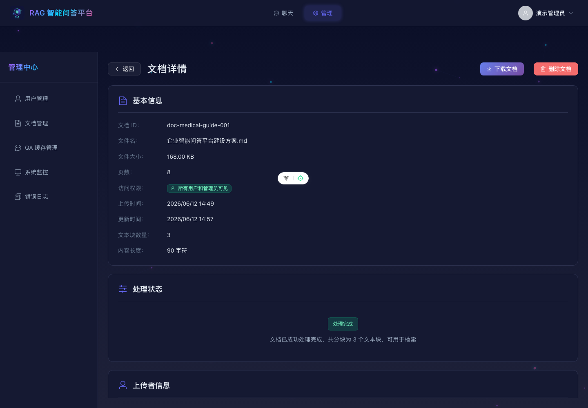

# RAG 智能问答平台

RAG 智能问答平台是一套面向企业知识管理、智能客服、内部制度问答和业务资料检索的综合应用。它把分散在文档、表格、历史问答和运维记录中的知识整理成可登录、可管理、可追溯、可监控的智能问答系统。项目不是单一聊天页面，而是包含用户体系、知识库管理、文档处理、问答缓存、会话沉淀、系统监控、错误日志和管理后台的完整平台。

本项目已经准备好一套可直接演示的数据。演示数据包含 4 个用户、4 份知识库文档、12 个文档分块、3 个历史会话、8 条问答消息、4 条高质量问答缓存、4 条质量评估记录、3 条评估样例和一批运行监控数据。打开页面后，面试官可以直接看到系统已经具备真实业务状态，而不是空白模板。

## 在线演示效果

### 登录页



### 智能问答页



### 用户管理


### 文档管理



### 问答缓存管理


### 系统监控


### 错误日志



### 文档详情



## 演示账号

| 角色 | 登录昵称 | 登录密码 | 适合展示的内容 |
| --- | --- | --- | --- |
| 管理员 | 演示管理员 | Demo@123456 | 管理后台、文档权限、系统监控、问答缓存 |
| 普通用户 | 业务咨询用户 | Demo@123456 | 普通问答、公开文档检索、会话管理 |
| 知识库维护员 | 知识库维护员 | Demo@123456 | 文档治理、问答复核、知识库运营 |
| 一线客服 | 一线客服 | Demo@123456 | 高频问题沉淀、客服标准话术场景 |

推荐面试演示时使用“演示管理员 / Demo@123456”登录，因为该账号可以进入管理中心，能完整展示用户、文档、问答缓存、监控和日志等页面。

## 本地运行

### 1. 启动基础服务

项目依赖 MongoDB、Milvus、Kafka 和 Redis。MongoDB、Milvus、Kafka 已经分别放在对应目录下，可以按下面命令启动。

```bash
docker compose -f mongodb/docker-compose.yml up -d
docker compose -f milvus/docker-compose.yml up -d
docker compose -f Kafka/docker-compose.yml up -d
docker start redis_dev 2>/dev/null || docker run -d --name redis_dev -p 6379:6379 redis:7-alpine
```

### 2. 安装依赖

```bash
python3 -m pip install -r requirements.txt
cd web/plantform_vue
npm install
```

### 3. 导入演示数据

```bash
cd /Users/haogeng/Desktop/genghao/work2/worktest/plantform
python3 scripts/seed_demo_data.py --reset
```

执行后会重建 `rag_platform` 数据库，并写入用户、文档、分块、会话、消息、问答缓存、质量评估和监控日志等演示数据。该命令适合本地演示环境使用，如果已有重要数据，请先单独备份。

### 4. 启动后端服务

```bash
cd /Users/haogeng/Desktop/genghao/work2/worktest/plantform
uvicorn main:app --host 0.0.0.0 --port 8001 --log-level info
```

健康检查地址：

```bash
curl http://127.0.0.1:8001/health
```

返回 `{"status":"healthy"}` 表示服务已经可以使用。

### 5. 启动前端服务

```bash
cd /Users/haogeng/Desktop/genghao/work2/worktest/plantform/web/plantform_vue
npm run dev -- --host 0.0.0.0 --port 5173
```

浏览器访问：

```text
http://127.0.0.1:5173
```

## 项目定位

很多企业在知识管理上会遇到同一个问题：文档很多，真正能回答问题的知识却很难被及时找到。制度文档、产品资料、客服话术、评估表、操作规范和运维记录经常分散在多个文件夹、多人电脑或历史系统中。新人不知道从哪里查，老员工依赖经验转述，客服需要反复复制同样答案，管理员也缺少一个统一视角去判断哪些文档真正被使用、哪些问答真正有价值、哪些回答需要复核。

这个平台的目标，是把“文档存储”提升成“可运营的知识问答服务”。文档上传后不只是保存在目录里，而是进入可检索、可权限控制、可追溯、可评估、可缓存、可监控的知识链路。用户提问时，系统不仅给出回答，还能让管理员看到回答来自哪些资料、哪些问题被高频命中、哪些缓存答案值得保留、哪些系统指标需要关注。

从面试角度看，这个项目能体现的不只是会写一个聊天框，而是能够把多个工程模块组合成一个可用系统。它包含登录、权限、文件管理、知识库、异步处理、运行监控、后台管理、状态持久化、前后端联动和演示数据准备。这样的项目更接近真实业务系统，也更适合用来讲清楚自己在产品理解、工程落地和系统设计上的能力。

## 业务背景

在智能问答出现以前，企业知识库常见的形态是网盘、在线文档、帮助中心或客服手册。这些工具能保存内容，却不能保证用户提出自然语言问题时快速得到可用答案。比如用户问“普通员工能不能看到管理员上传的内部规范”，传统搜索可能只返回多个文件标题，用户还要自己打开文档寻找段落。RAG 智能问答的价值在于，它可以先理解问题，再检索相关片段，最后生成面向用户的完整回答。

但是，真正可落地的 RAG 系统不能只考虑回答生成。企业场景更关心几个问题。第一，资料权限是否可控。不同角色能看到的知识范围不同，普通用户不应该命中管理员文档。第二，回答是否可追溯。系统给出答案后，管理员需要知道它参考了哪些文档。第三，高频问题是否能沉淀。相似问题反复出现时，平台应该复用经过验证的高质量答案。第四，系统是否可运营。文档数量、处理状态、分块数量、问答缓存、监控指标和错误记录都需要被看见。

本项目围绕这些现实问题设计。它把用户登录、文档管理、智能问答、缓存管理、监控面板和日志中心放在同一个平台里。普通用户进入聊天页完成咨询，管理员进入管理中心维护数据，知识库维护员观察文档和缓存质量，一线客服可以把高频问答沉淀成标准口径。这样的分工符合企业内部知识平台的使用方式。

## 核心价值

第一，平台把文档变成可问答的知识资产。演示数据中包含 Markdown、PDF、Word 和 Excel 类型的业务资料。文档管理页能看到文件名称、处理状态、权限范围和分块数量。分块数量不是展示用的死数据，而是和文档片段记录对应，说明每份资料已经进入可检索状态。

第二，平台支持角色和权限。演示管理员可以看到全部后台能力，普通用户只能使用面向用户的问答能力。文档自身也区分公开文档和管理员文档。这个设计适合讲企业场景下的数据边界意识：智能问答不是把所有内容混在一起，而是在检索和展示阶段都保留权限约束。

第三，平台沉淀高质量问答。问答缓存页展示了 4 条已经整理好的问答，例如“这个平台如何把企业文档变成可追溯问答”“管理员文档会不会被普通用户看到”“问答缓存有什么价值”“上传文档后为什么有处理状态”。这些问题覆盖平台核心能力，也能让面试官快速理解系统不是空壳。

第四，平台具备运营视角。系统监控页展示 CPU、内存、MongoDB 连接、集合数量、文档数量、运行记录等信息。错误日志页展示异常记录和时间信息。管理者可以通过这些页面判断服务是否健康，而不是只能依赖命令行。

第五，平台有完整演示闭环。登录后能进入聊天页，聊天页能看到历史会话，管理页能看到真实用户，文档页能看到真实文档，缓存页能看到真实问答，监控页能看到真实运行数据，日志页能看到真实记录，文档详情页能看到文档内容和元信息。这种闭环非常适合面试展示。

## 页面导览

### 登录体验

登录页采用深色科技风格，视觉上强调“RAG 智能问答平台”的产品定位。页面提供昵称密码登录和验证码登录两种入口。演示时推荐使用昵称密码方式，因为账号已经预置好，可以直接进入系统，不需要等待邮件验证码。

登录成功后，系统会根据用户身份进入对应功能范围。管理员可以访问管理中心，普通用户主要使用聊天页。这样的设计有两个好处：一是演示时能快速进入重点页面，二是体现了基础身份体系已经打通。面试官通常会关心项目是不是只有前端假页面，登录后能看到真实用户信息和真实后台数据，会明显提升可信度。

### 智能问答体验

聊天页是普通用户使用最频繁的入口。左侧是会话列表，右侧是当前对话区域。演示数据中已经准备了“平台建设方案问答”和“知识库运营流程”两个历史会话，每个会话都带有最近一条消息摘要。这样打开页面后不会是空白状态，面试官可以直接看到系统支持会话沉淀。

聊天页底部提供输入框、发送按钮、文件上传入口和“显示思考过程”开关。这个设计适合企业知识问答场景：用户既可以直接提问，也可以上传临时文件让系统结合内容处理。显示思考过程开关则让系统具备更强解释性，适合演示“回答不是凭空生成，而是经过问题理解、资料检索和答案组织”。

在演示中可以这样讲：用户提出业务问题后，平台会先结合权限范围查找知识材料，再组织回答，并把会话保留下来。对于高频问题，管理员可以在问答缓存页进行复核和管理。这样普通提问、知识库、缓存和后台管理形成完整闭环。

### 用户管理体验

用户管理页展示了 4 个演示用户：演示管理员、业务咨询用户、知识库维护员和一线客服。每个用户都有昵称、邮箱、角色和状态。管理员可以通过这个页面观察系统里的账号结构，也可以进行角色调整和用户维护。

这个页面适合面试中讲“权限体系不是后补的，而是项目从一开始就考虑了不同角色”。企业知识平台通常不会只有一个用户。管理员需要上传和维护文档，普通员工需要查询制度，一线客服需要查询话术，知识库维护员需要审核和整理高质量回答。用户管理页把这些角色放到同一个后台里，体现了系统对真实组织结构的适配。

### 文档管理体验

文档管理页是知识库运营的核心入口。演示数据中包含 4 份文档：企业智能问答平台建设方案、RAG 知识库运营规范、客服常见问题与标准话术、RAG 评估样例集。每份文档都显示处理完成状态、权限范围、上传时间和分块数量。

分块数量在面试中很重要。它说明系统没有只保存文件名，而是把文档内容拆成适合检索的知识片段。演示数据里每份文档都有 3 个分块，一共 12 个分块。这个设计让“文档变知识”的过程可以被后台看见，也方便解释后续问答为什么能够定位到具体资料。

文档权限同样值得强调。部分文档设置为公开可见，部分文档设置为管理员可见。这样普通用户提问时不会越权命中内部资料，管理员提问时可以使用更完整的知识范围。对于企业知识平台来说，权限边界是决定能不能上线的重要条件。

### 问答缓存管理体验

问答缓存管理页展示平台沉淀下来的高质量问答。演示数据中准备了 4 条缓存记录，覆盖平台建设、权限控制、缓存价值和文档处理状态。每条缓存都包含问题、答案摘要、创建时间和可进入详情的标识。

问答缓存的价值可以从两个角度讲。对用户来说，相似问题可以更快得到稳定答案，减少重复生成带来的等待和波动。对管理员来说，高频问题会集中展示出来，方便人工复核、改写和沉淀标准答案。对系统来说，缓存可以降低重复计算成本，也能让服务更稳定。

这个页面体现了“智能问答不是一次性生成，而是可持续运营”。很多 RAG 项目只做到提问和回答，本项目进一步把优秀回答沉淀成可管理资产，符合真实企业长期使用的需求。

### 系统监控体验

系统监控页展示运行时状态，包括 CPU、内存、磁盘、MongoDB 状态、连接数、集合数量、文档数量和性能记录。演示数据中已经生成一批监控记录，同时服务启动后也会继续写入新的资源状态。

这个页面适合讲工程完整性。智能问答平台不是离线脚本，运行时需要关注数据库连接、资源占用、处理队列和服务健康。如果没有监控，系统出现问题时只能靠人工猜测。把监控放进后台后，管理员可以在页面上看到服务状态，面试官也能感受到项目更接近线上系统。

### 错误日志体验

错误日志页展示系统运行中记录的异常和告警信息。演示数据中已经准备了文档处理重试、缓存命中率低等记录。页面支持日期选择、刷新、统计概览和日志详情展开。日志详情里可以看到时间、等级、消息、位置和完整记录。

这个页面不是为了展示错误，而是为了展示平台具备自我观察能力。企业应用上线后，异常不可避免，关键是有没有机制让管理员知道发生了什么。错误日志页和系统监控页配合，可以形成运行状态观察闭环。

### 文档详情体验

文档详情页展示单份文档的名称、大小、页数、权限、状态、内容摘要和处理信息。面试时可以从文档列表进入详情页，说明系统对每份资料都有独立状态记录。管理员不仅能看到“有这个文件”，还能看到文件是否完成处理、属于哪类权限、内容是否已经抽取。

文档详情页也能帮助解释 RAG 的基础链路：文档先进入平台，再完成内容抽取和分块，随后参与问答检索。没有文档详情页，知识库往往显得像黑盒；有了详情页，管理员可以理解每份资料在系统中的状态。

## 演示数据说明

演示库中准备的数据不是随手拼凑，而是围绕企业知识问答平台本身设计。这样面试演示时，页面内容和项目主题一致，讲解会更自然。

### 用户数据

用户数据包含 4 个角色。演示管理员负责平台管理，业务咨询用户代表普通使用者，知识库维护员负责资料和缓存运营，一线客服代表高频业务咨询场景。每个用户都有邮箱、头像、角色和状态。管理员账号可以进入后台，普通账号主要使用聊天能力。

### 文档数据

文档数据包含 4 份业务资料。第一份是企业智能问答平台建设方案，适合解释项目整体价值。第二份是 RAG 知识库运营规范，适合解释文档上传、权限分级、问答缓存和复核流程。第三份是客服常见问题与标准话术，适合解释一线客服场景。第四份是 RAG 评估样例集，适合解释质量评估和回答效果观察。

每份文档都有 3 个知识片段。文档页显示的分块数来自这些片段，说明后台展示和数据记录是对应的。面试时可以讲：平台不是只展示文件名，而是让文档进入后续问答链路。

### 会话和消息数据

会话数据包含平台建设方案问答、知识库运营流程和普通用户咨询。管理员登录后可以看到属于管理员的会话，普通用户登录后可以看到自己的咨询记录。消息数据包含用户提问和 AI 回答，并在回答中记录引用文档、思考步骤和反馈统计。

这部分数据适合演示聊天页不是空白页面。打开系统后，左侧会话列表已经有业务内容，面试官可以马上理解系统支持历史会话和问答沉淀。

### 问答缓存数据

问答缓存数据包含 4 条高质量问答。每条问答都有问题、答案、命中次数、点赞数、点踩数、来源文档和审核状态。缓存问题围绕项目核心能力设计，能帮助面试官快速理解平台逻辑。

缓存数据可以这样讲：当用户反复询问相似问题时，系统不必每次都从头生成，而是优先复用经过评估的答案。管理员可以观察缓存命中情况和反馈情况，把真正高质量的回答留下来。

### 评估和监控数据

评估数据包含回答忠实度、答案相关度、上下文准确率和召回效果等指标。监控数据包含系统资源、数据库状态、运行耗时和错误记录。它们让平台不只是一个问答工具，而是一个能够被运营、被观察、被持续改进的系统。

## 适合面试讲解的主线

面试时建议不要从技术名词开始，而是先从业务问题讲起。可以用下面的顺序：

第一步，说明企业知识管理痛点。企业资料很多，但用户要找到答案很难。传统搜索只返回文档，不能直接回答问题，也不能保证权限和来源。

第二步，说明系统目标。这个平台把文档、问答、缓存、权限和监控统一起来，让用户能问问题，让管理员能维护知识，让系统运行状态可观察。

第三步，演示登录。使用“演示管理员 / Demo@123456”进入系统，说明平台支持账号体系和管理员权限。

第四步，演示聊天页。展示历史会话和输入区域，说明用户可以持续提问，也可以上传文件，系统会保留会话记录。

第五步，演示文档管理。展示 4 份真实演示文档和每份 3 个分块，说明文档已经进入知识库处理链路。

第六步，演示问答缓存。展示 4 条高质量问答，说明系统能把高频问题沉淀下来，并支持后续复核。

第七步，演示监控和日志。说明项目考虑了运行状态，而不是只做页面展示。

第八步，总结技术能力。可以讲 FastAPI、Vue 3、MongoDB、Milvus、Redis、Kafka、文档处理、权限控制和后台管理，但重点放在“为什么这些模块组成一个完整业务闭环”。

## 系统模块设计

### 用户与权限模块

用户模块负责登录、身份保存、角色判断和后台访问控制。平台支持管理员和普通用户两类核心身份。管理员可以进入管理中心，普通用户主要使用智能问答。用户信息包含昵称、邮箱、头像、性别、生日、状态和角色标识。

权限设计不仅体现在页面路由，也体现在文档数据上。文档可以设置为公开可见或管理员可见。这样问答系统在处理资料时可以保留知识边界，避免普通用户看到不该看到的内容。这个设计对企业应用非常重要，因为知识库通常既有公开帮助文档，也有内部制度、管理规范和敏感资料。

### 文档管理模块

文档管理模块负责展示文件列表、处理状态、权限范围、上传时间和分块数量。平台支持多种文档类型，适合承载制度、方案、表格和话术。文档进入系统后，会形成文档记录和知识片段记录。后台可以通过状态字段判断文档是否处理完成，通过分块数量判断文档是否已经完成知识化。

文档模块的价值在于让知识库透明化。管理员不再只知道“上传了一个文件”，而是能知道文件是否完成处理、是否可参与问答、属于哪个权限范围、拆成了多少知识片段。

### 智能问答模块

智能问答模块面向普通用户。用户可以在聊天页创建新会话、查看历史会话、发送问题、上传文件，并选择是否显示思考过程。系统会把对话保存下来，形成可回看的业务记录。会话列表展示最近消息，便于用户回到之前的问题上下文。

这个模块适合展示前后端联动。页面不是静态聊天框，而是能读取登录用户、展示其会话、发送消息并接收回答。演示数据已经包含历史会话，因此打开页面时能立刻看到真实状态。

### 问答缓存模块

问答缓存模块负责沉淀高质量问答。系统将经过评估或人工复核的问答保存为缓存记录，管理员可以查看问题、答案摘要、命中次数、反馈数据和来源文档。缓存不是简单复制历史回答，而是面向高频问题的知识资产。

问答缓存有三个实际价值。第一，提升响应速度。相似问题出现时，可以优先使用稳定答案。第二，提升答案一致性。客服场景尤其需要标准口径。第三，帮助知识库运营。管理员可以通过缓存列表发现用户真正关心的问题。

### 监控模块

监控模块负责展示运行状态。它记录系统资源、数据库状态、集合数量、文档数量、调用次数和性能记录。平台启动后会持续写入资源状态，管理员可以在页面看到变化趋势。

监控模块体现了项目的工程完整性。一个能上线的系统不只需要功能，还需要观察能力。监控页可以帮助判断服务是否健康、数据库是否连接正常、资源使用是否异常。

### 日志模块

日志模块负责展示异常和告警记录。页面提供统计卡片、日志列表、搜索和详情展开。演示数据中包含文档处理重试和缓存命中率提醒等记录，便于面试时展示运行观察能力。

日志模块和监控模块配合，可以解释系统如何发现问题、定位问题和持续维护。即使面试中不深入展开，也能说明项目不是纯前端演示，而是考虑了运维和长期运行。

### 管理后台模块

管理后台把用户、文档、问答缓存、监控和日志放在统一入口。左侧菜单清晰展示功能模块，右侧内容区域展示具体数据。管理员登录后可以在各页面之间切换，完整观察平台状态。

后台模块是整个项目展示价值最高的部分。它让面试官在几分钟内看到系统的完整度：账号存在、文档存在、会话存在、缓存存在、监控存在、日志存在。这比单纯展示聊天页更能证明项目落地程度。

## 技术架构说明

前端使用 Vue 3、Pinia、Element Plus 和 Vite。Vue 3 负责页面组件和响应式状态，Pinia 保存登录状态和用户信息，Element Plus 提供表格、按钮、菜单、表单和弹窗等基础组件，Vite 负责本地启动和打包构建。前端整体采用深色科技风格，适合智能问答平台的产品定位。

后端使用 FastAPI 和 Uvicorn。FastAPI 负责服务路由、参数校验、响应组织和中间件处理。Uvicorn 负责运行服务。后端按模块划分用户、文档、会话、消息、日志、监控、问答缓存和可视化能力，每个模块承担清晰职责。

数据层使用 MongoDB 保存用户、文档、会话、消息、问答缓存、评估结果和文档分块。MongoDB 适合保存这类结构灵活的数据，因为不同消息和文档会携带不同扩展字段。Milvus 用于承载向量检索能力，适合处理文档知识片段和相似问答。Redis 用于缓存和验证码等短期状态。Kafka 用于文档处理任务的异步流转。

文档处理链路面向多格式资料。文档进入系统后，会先保存基础信息，再进行文本抽取、分块和后续处理。后台展示的状态和分块数可以让管理员看到处理结果。对于企业项目来说，这种异步处理方式比同步等待更符合实际，因为文档可能很大，解析和向量化都需要时间。

智能问答链路围绕“问题理解、知识检索、权限过滤、答案组织、结果沉淀”展开。用户提出问题后，系统会结合用户身份和知识库内容组织回答。回答过程中的来源文档、思考步骤和反馈数据可以保存下来，为后续复核和缓存提供依据。

后台运营链路围绕“数据可看、状态可查、异常可追、质量可评”展开。用户管理页看账号，文档管理页看知识资料，问答缓存页看高频问答，监控页看运行状态，日志页看异常记录。这些页面共同说明平台具备长期运营的基础。

## 数据流转过程

### 从文档到知识片段

管理员上传文档后，系统会保存文档记录，包括文件名称、大小、页数、权限、状态、上传人和上传时间。随后文档内容会被抽取成文本，再按照适合检索的长度拆成多个知识片段。每个片段记录所属文档、顺序、页码、内容和扩展信息。

文档管理页显示的“分块数”来自这些知识片段。演示数据中 4 份文档一共 12 个片段，说明每份文档都已经具备参与问答的基础。

### 从问题到答案

用户在聊天页提出问题后，系统会结合会话信息和用户身份处理。平台先判断问题所属场景，再从可访问的知识范围中寻找相关资料，最后组织成自然语言答案。回答中可以携带引用文档和思考步骤，便于用户理解答案来源。

这种方式比传统关键词搜索更适合自然语言提问。用户不需要知道文档标题，也不需要逐个打开文件，只要提出问题即可获得面向业务的回答。

### 从答案到缓存

当一个回答质量较高，或者问题属于高频场景时，系统可以把问答保存为缓存记录。缓存记录包含问题、答案、来源文档、命中次数、点赞数、点踩数、审核状态和创建时间。管理员可以在问答缓存页查看这些记录，并对其进行管理。

问答缓存让系统具备持续学习和沉淀能力。随着使用时间增加，平台中会积累越来越多标准答案，客服和内部员工都能获得更稳定的回复。

### 从运行到监控

系统运行时会持续产生资源状态、数据库状态和性能记录。监控模块把这些记录展示出来，管理员可以查看 CPU、内存、连接数、集合数量、文档数量等状态。日志模块则展示异常和告警，帮助判断服务是否需要关注。

这条链路说明项目不只关注功能，还关注服务运行。对面试官来说，这是区分课程作业和真实应用的重要信号。

## 面试展示建议

建议把演示控制在 8 到 12 分钟。时间太短会展示不出完整度，时间太长容易陷入细节。可以按下面节奏进行。

第一分钟介绍业务背景：企业资料分散，用户找答案慢，知识难复用，管理员缺少运营视角。

第二分钟打开登录页，用演示管理员账号登录，说明平台具备用户体系和权限判断。

第三分钟展示聊天页，讲会话列表、历史问题、文件上传、思考过程开关和普通用户问答体验。

第四分钟进入文档管理页，讲 4 份资料、处理状态、权限范围和分块数量。强调文档已经被拆成知识片段。

第五分钟进入问答缓存页，讲高频问题沉淀、标准答案复用和人工复核价值。

第六分钟进入用户管理页，讲管理员、普通用户、维护员和客服角色。

第七分钟进入系统监控页，讲运行状态、数据库状态和资源观察。

第八分钟进入错误日志页，讲异常记录和长期维护能力。

最后两到三分钟总结技术栈和工程亮点：Vue 3 前端、FastAPI 后端、MongoDB 持久化、Milvus 向量检索、Redis 缓存、Kafka 异步处理、权限体系、问答缓存和监控日志。

如果面试官追问技术细节，可以从“为什么要拆分文档”“为什么需要问答缓存”“为什么要做权限过滤”“为什么要保留监控和日志”几个角度展开。不要只罗列技术名词，要把技术选择和业务价值联系起来。

## 项目亮点

### 亮点一：不是单页聊天，而是完整平台

很多智能问答项目只做一个输入框和回答区域，展示时很难证明系统具备真实使用价值。本项目包含登录、聊天、用户、文档、缓存、监控、日志和详情页。面试官能看到平台级结构，而不是单点能力。

### 亮点二：演示数据贴合业务主题

演示数据围绕 RAG 平台自身设计。文档名称、缓存问题、历史会话和监控记录都能服务于讲解。这让演示过程更自然，不会出现页面内容和项目主题无关的尴尬情况。

### 亮点三：有权限意识

企业知识平台必须考虑权限。项目中用户有管理员和普通用户区分，文档也有公开和管理员可见两类。这个设计说明系统不是把所有资料简单混合，而是考虑了真实组织内部的数据边界。

### 亮点四：有知识运营闭环

文档上传只是第一步。平台还支持问答缓存、质量评估、反馈统计和后台复核。这个闭环让知识库可以持续变好，而不是一次性导入后无人维护。

### 亮点五：有运行观察能力

监控和日志页面展示系统运行状态。面试中能讲清楚系统如何观察数据库、资源和异常。这类能力在真实项目中很重要，也能体现工程意识。

### 亮点六：前后端数据真实联动

截图中的用户、文档、缓存、会话和监控都来自本地数据库和运行记录。页面不是静态图片，也不是硬编码文本。重新导入演示数据后，系统可以再次恢复同样的演示状态。

## 常见面试问答准备

### 为什么选择 RAG 而不是只调用大模型？

只调用大模型无法保证回答基于企业内部资料，也无法及时更新知识。RAG 可以把企业文档作为回答依据，让答案更贴近业务内容。文档更新后，知识库也可以更新，不需要重新训练模型。对于制度、产品说明、客服话术和内部流程这类场景，RAG 更适合落地。

### 为什么要做文档分块？

大文档通常包含很多主题，直接把整篇文档交给模型会导致上下文过长、定位不准、成本变高。分块后，系统可以只检索和问题相关的片段，提高回答准确性，也能让后台看到每份文档的处理状态。演示数据中每份文档都有 3 个分块，说明文档已经进入可检索状态。

### 为什么需要问答缓存？

企业场景中高频问题很多，例如权限规则、上传流程、标准话术和常见故障。如果每次都重新生成，回答可能不稳定，也会增加等待时间。问答缓存可以保存经过验证的高质量答案，让相似问题得到更快、更一致的回复。管理员还可以通过缓存列表发现用户真正关心的问题。

### 为什么需要管理员后台？

智能问答系统不是部署后就结束。管理员需要维护用户、上传资料、观察文档状态、复核问答、查看监控和处理异常。后台让这些操作集中在一个入口，降低长期运营成本。没有后台的问答系统很难在真实企业中持续使用。

### 为什么要做系统监控和错误日志？

运行状态决定系统是否可靠。文档处理、数据库连接、资源占用和异常记录都可能影响用户体验。监控和日志可以让管理员及时发现问题，也方便面试时说明项目不仅能跑，还考虑了维护。

### 项目如何体现权限控制？

用户有管理员和普通用户身份，后台页面需要管理员权限。文档也有公开和管理员可见两种范围。普通用户只应该使用公开知识，管理员可以访问更完整的资料。这样可以避免知识库越权使用。

### 项目如何继续扩展？

后续可以继续扩展企业微信或钉钉登录、文档版本管理、人工审核工作台、更多评估指标、多知识库隔离、审计报表、团队空间、批量导入和知识图谱展示。当前项目已经搭好用户、文档、问答、缓存、监控和后台基础，后续扩展有清晰落点。

## 真实数据核验

当前演示库包含以下记录：

| 数据类型 | 数量 | 说明 |
| --- | ---: | --- |
| 用户 | 4 | 管理员、普通用户、知识库维护员、一线客服 |
| 文档 | 4 | 覆盖方案、规范、话术、评估样例 |
| 文档分块 | 12 | 每份文档 3 个知识片段 |
| 会话 | 3 | 管理员和普通用户各有历史会话 |
| 消息 | 8 | 用户问题和 AI 回答成对保存 |
| 问答缓存 | 4 | 高频问题和标准答案 |
| 质量评估 | 4 | 回答忠实度、相关度、召回等指标 |
| 评估样例 | 3 | 权限控制、文档处理、缓存价值 |

这些数据可以通过页面看到，也可以通过数据库查询核验。演示时不需要临时造数据，直接启动服务即可查看完整状态。

## 目录结构

```text
api/                         服务路由与页面数据入口
internal/                    核心业务模块
internal/db/                 MongoDB、Milvus、Redis 连接
internal/model/              用户、文档、消息、缓存、评估等数据模型
internal/service/            用户、文档、问答、日志、监控等业务能力
pkg/                         公共工具、鉴权、模型配置和工具能力
web/plantform_vue/           Vue 3 前端应用
mongodb/                     MongoDB 本地服务配置
milvus/                      Milvus 本地服务配置
Kafka/                       Kafka 本地服务配置
scripts/seed_demo_data.py    演示数据导入脚本
docs/screenshots/            README 使用的真实运行截图
```

## 页面内容与数据对应关系

登录页对应用户体系。管理员登录后可以进入管理中心，普通用户登录后进入聊天能力。

聊天页对应会话和消息数据。左侧会话列表来自历史会话，右侧对话区展示当前会话状态。

用户管理页对应用户数据。页面中能看到 4 个演示账号和不同角色。

文档管理页对应文档和分块数据。页面中 4 份文档都显示处理完成，每份文档显示 3 个分块。

问答缓存页对应缓存和思维链数据。页面中 4 条问答缓存都来自演示库。

系统监控页对应运行监控数据。页面中能看到资源状态、数据库状态和运行记录。

错误日志页对应日志数据。页面中能看到异常与告警记录，并支持展开详情。

文档详情页对应单份文档的完整信息。页面中可以看到文档名称、状态、权限、内容和元信息。

## 适合放在简历里的描述

可以在简历中这样描述：

“独立实现企业级 RAG 智能问答平台，支持用户登录、角色权限、知识库文档管理、智能问答、历史会话、问答缓存、质量评估、系统监控和日志管理。前端基于 Vue 3、Pinia、Element Plus 构建后台与聊天界面，后端基于 FastAPI 构建服务能力，使用 MongoDB 保存业务数据，Milvus 承载向量检索，Redis 处理缓存状态，Kafka 支撑文档异步处理。项目准备了完整演示数据和运行截图，可展示从文档上传、知识分块、权限控制、问答生成到缓存沉淀和运行监控的完整闭环。”

如果简历篇幅有限，可以缩短为：

“企业级 RAG 智能问答平台：实现登录权限、文档知识库、智能问答、问答缓存、质量评估、监控日志和管理后台；使用 Vue 3 + FastAPI + MongoDB + Milvus + Redis + Kafka，完成从文档知识化到可追溯问答的完整闭环。”

## 可以重点强调的个人能力

### 产品理解能力

项目从企业知识管理痛点出发，不是单纯堆技术。登录、文档、问答、缓存、监控和日志都服务于“让企业知识可查询、可追溯、可运营”的目标。面试时可以强调自己不是只完成页面，而是先理解业务流程，再设计系统模块。

### 前后端协作能力

前端页面需要登录态、路由权限、表格展示、分页查询、错误提示和后台菜单。后端需要提供用户、文档、会话、缓存、监控和日志等服务能力。项目能跑通说明前后端字段、状态和页面流程已经对齐。

### 数据建模能力

项目中存在用户、文档、分块、会话、消息、问答缓存、评估记录和监控记录等多类数据。每类数据都有明确用途。比如文档记录负责基础信息，分块记录负责知识检索，消息记录负责会话回看，缓存记录负责高频问答沉淀。

### 工程落地能力

项目包含 Docker 服务、依赖安装、演示数据导入、后端启动、前端启动和截图验证。它不是只停留在代码层，而是能被实际启动、登录和展示。面试官看到页面和数据后，更容易相信项目具备真实交付能力。

### 质量意识

问答缓存、质量评估、监控和日志说明项目关注系统质量。很多项目只关注“能不能回答”，这个项目进一步关注“回答是否稳定、数据是否可看、系统是否健康、异常是否可追踪”。

## 演示讲稿参考

下面是一段可以在面试中直接使用的讲解稿：

“这个项目是一个企业级 RAG 智能问答平台，主要解决企业内部资料分散、员工查找答案慢、客服重复回答多、知识库缺少运营闭环的问题。平台把文档管理、智能问答、问答缓存、权限控制和系统监控放在一起。普通用户可以在聊天页提问，管理员可以在后台维护用户、文档和高质量问答，还能查看运行状态和错误日志。”

“我准备了一套完整演示数据，包括 4 个用户、4 份文档、12 个知识片段、3 个历史会话和 4 条问答缓存。登录后可以看到聊天页已经有历史会话，文档管理页能看到每份资料的处理状态和分块数量，问答缓存页能看到高频问题和标准答案，监控页能看到服务运行状态。这说明系统不是空白页面，而是有完整业务数据的可运行平台。”

“技术上，前端使用 Vue 3、Pinia 和 Element Plus，后端使用 FastAPI。MongoDB 保存用户、文档、会话、消息和缓存数据，Milvus 用于向量检索，Redis 用于缓存状态，Kafka 用于文档处理任务。系统设计重点不是单纯调用模型，而是让文档进入知识库，让回答可以追溯，让高频问题可以沉淀，让管理员能持续运营。”

“我认为这个项目最有价值的地方在于闭环完整。用户提问只是起点，后续还有文档知识化、权限控制、答案沉淀、质量评估、运行监控和日志观察。这些能力组合起来，才更接近真实企业会使用的智能问答平台。”

## 运行验收记录

当前本地演示环境已经完成以下核验：

| 验收项 | 结果 |
| --- | --- |
| MongoDB 容器 | 已启动 |
| Milvus 容器 | 已启动 |
| Kafka 容器 | 已启动 |
| Redis 容器 | 已启动 |
| 演示数据导入 | 已导入 |
| 后端健康检查 | 返回 healthy |
| 管理员登录 | 登录成功 |
| 用户管理数据 | 4 条用户记录 |
| 文档管理数据 | 4 份文档、12 个分块 |
| 问答缓存数据 | 4 条缓存记录 |
| 会话数据 | 3 个历史会话 |
| 监控数据 | 页面可读取 |
| 截图数量 | 8 张真实运行截图 |

## 后续优化方向

第一，可以增加文档版本管理。企业文档经常更新，后续可以保存每次上传版本，并记录问答使用的是哪个版本。

第二，可以增加人工复核工作台。管理员可以集中审核缓存答案，标记为标准答案、待修改或废弃。

第三，可以增加知识库空间隔离。不同部门可以拥有独立知识库，例如人事制度库、产品资料库、客服话术库和运维手册库。

第四，可以增加问答质量报表。按时间、用户、部门、问题类型统计命中率、满意度和缓存复用率。

第五，可以增加文件批量导入。企业历史资料多，批量导入能提升初始化效率。

第六，可以增加移动端适配。普通员工可能更多通过手机查询制度或流程，移动端体验有实际价值。

第七，可以增加组织架构权限。当前演示区分管理员和普通用户，后续可以扩展到部门、岗位、项目组等更细粒度的权限。

第八，可以增加更多业务工具。比如工单查询、订单查询、库存查询、天气查询、地图查询等，让问答平台从知识查询扩展到业务助手。

## 详细业务场景

### 场景一：企业制度咨询

企业内部经常有大量制度类文档，例如考勤制度、报销制度、资产申请流程、权限申请流程、项目审批规范和安全操作要求。传统做法通常是把文档放在网盘或在线文档里，员工遇到问题时自己搜索标题，再打开文档查找对应段落。这种方式对熟悉制度的人还可以接受，但对新员工、跨部门协作人员和一线客服来说，查找成本很高。

本平台可以把制度类资料上传到知识库。员工直接用自然语言提问，例如“出差报销需要哪些材料”“管理员资料普通用户能不能看到”“文档上传后什么时候可以参与问答”。系统会根据知识库内容生成答案，并保留会话记录。管理员可以通过文档管理页查看制度资料是否已经处理完成，也可以通过问答缓存页观察哪些问题被反复咨询。

这个场景适合面试中说明 RAG 的真实价值。大模型本身不知道企业制度，传统搜索只能返回文档，而 RAG 平台可以把企业文档转化成可问答的服务。员工不用记住文件名，也不用翻找目录，只需要提出问题。

### 场景二：客服标准话术沉淀

客服团队每天会面对大量重复问题，例如账号登录失败、资料上传失败、权限不足、处理进度查询、功能使用说明和常见异常解释。如果每个客服都凭经验回答，口径容易不一致；如果所有问题都靠人工复制文档，效率又会很低。

平台中的“客服常见问题与标准话术.docx”就是为这个场景准备的演示资料。一线客服可以在聊天页输入客户问题，系统根据话术文档和知识库内容生成回答。管理员可以把高质量回答保存为问答缓存，后续相似问题出现时，系统可以复用稳定答案。问答缓存页展示的命中次数、点赞数和点踩数可以帮助团队判断哪些回答真正有效。

这个场景能体现项目不是单纯“聊天”，而是能帮助团队沉淀可复用知识。对企业而言，客服标准话术是一种重要资产。平台把这些话术从文档变成可查询、可复核、可迭代的问答数据。

### 场景三：知识库运营

知识库不是一次上传就结束。资料会过期，回答会失效，新问题会不断出现。知识库运营人员需要知道哪些文档已处理、哪些文档权限较高、哪些问题高频出现、哪些回答需要审核、系统运行是否健康。

本平台为知识库运营准备了多个管理入口。文档管理页用于查看资料状态，问答缓存页用于管理高频答案，监控页用于观察系统运行，错误日志页用于查看异常记录。知识库维护员可以定期检查缓存问题，判断是否需要更新文档或改写标准答案。

这个场景适合说明项目的长期价值。很多问答系统上线初期效果不错，但缺少运营能力后会逐渐失效。本项目把“可运营”作为核心设计目标之一，让管理员能够持续维护知识质量。

### 场景四：新员工培训

新员工进入企业后，常常需要了解系统使用方式、内部流程、权限边界和业务规范。如果所有问题都找同事咨询，会占用大量人力，也容易得到不一致的回答。把常用培训资料上传到平台后，新员工可以自己提问，系统根据知识库回答。

例如新员工可以问“文档上传后为什么要等待处理”“普通用户能看到哪些资料”“问答缓存有什么作用”。这些问题在演示数据中已经准备好答案。管理员也可以通过会话记录和缓存数据发现新人最常问的问题，从而优化培训资料。

这个场景能体现平台的人效价值。它不是替代所有培训，而是承担高频、标准、可文档化的问题，让导师和管理者把时间留给更复杂的沟通。

### 场景五：内部技术支持

企业内部系统经常有运维说明、故障处理手册、部署规范和使用说明。技术支持人员遇到问题时，需要快速定位操作流程。把这些资料放入平台后，支持人员可以用自然语言查询处理步骤，管理员可以通过日志和监控判断服务自身状态。

本项目的系统监控和错误日志页面可以用来讲这个场景。监控页显示资源状态和数据库状态，日志页显示异常记录。虽然演示环境是本地运行，但页面结构已经体现了线上服务需要的观察能力。

## 数据模型说明

### 用户记录

用户记录保存平台账号信息，包括唯一标识、昵称、邮箱、头像、性别、生日、创建时间、角色状态和账号状态。演示库中准备了 4 个用户，对应管理员、普通用户、知识库维护员和一线客服。用户数据的存在让权限演示有了真实基础，而不是只在页面上写一个角色名称。

用户模型的关键点是角色标识。管理员可以进入管理后台，普通用户不能进入后台。面试时可以说明，平台并不是所有登录用户都拥有相同功能，而是通过身份控制访问范围。这是企业系统中非常常见、也非常必要的设计。

### 文档记录

文档记录保存知识库资料的基础信息，包括文档唯一标识、名称、内容摘要、页数、访问地址、文件大小、处理状态、权限范围、上传人和上传时间。文档状态能让管理员知道资料是否已经处理完成，权限范围能让系统区分公开资料和内部资料。

演示库中的 4 份文档覆盖方案、规范、话术和评估样例。它们的名称和内容都与项目主题一致，便于面试时围绕同一条业务线讲解。

### 分块记录

分块记录保存文档拆分后的知识片段。每条分块包含所属文档、片段内容、顺序、页码、向量记录标识和扩展信息。分块是 RAG 系统中非常关键的一层，因为用户提问时通常不会命中整篇文档，而是命中文档中的某几个相关片段。

演示数据中每份文档有 3 个分块。后台文档列表显示的“分块数”正是这些记录的统计结果。面试时可以通过这个字段说明：平台能让管理员看到知识处理状态，而不是把文档处理藏成黑盒。

### 会话记录

会话记录保存用户和系统之间的一段连续交流。每个会话有名称、所属用户、最近消息、创建时间和更新时间。聊天页左侧的会话列表来自这些记录。用户可以通过会话列表回到之前的问题上下文，管理员也可以通过会话数据理解用户使用情况。

演示库中准备了平台建设方案问答、知识库运营流程和普通用户咨询三个会话。管理员登录后可以看到管理员自己的两个会话，普通用户登录后可以看到普通用户自己的咨询记录。

### 消息记录

消息记录保存每次用户提问和系统回答。用户消息包含发送人、内容、时间和会话归属。系统回答除了内容之外，还可以保存引用文档、思考步骤、反馈数据和缓存标识。这些扩展信息让回答不只是文本，而是可以被追踪和评估的业务记录。

演示库中准备了 8 条消息，包含 4 个问题和 4 个回答。每条回答都围绕平台能力展开，方便演示时从聊天页过渡到问答缓存和文档管理。

### 问答缓存记录

问答缓存记录保存高质量问题和答案，包括问题原文、标准答案、审核状态、评分、命中次数、反馈数量、来源文档和业务分类。缓存记录是知识运营的重要资产。它把历史回答转化为可复用内容，减少重复问题的处理成本。

演示库中准备了 4 条问答缓存，分别说明平台如何把文档变成可追溯问答、管理员文档是否会被普通用户看到、问答缓存有什么价值、上传文档后为什么有处理状态。这些问题覆盖了面试官最可能关注的几个能力点。

### 评估记录

评估记录保存回答质量数据，例如忠实度、相关度、上下文准确率、上下文召回率和综合评分。评估数据说明平台关注回答质量，而不是只关注有没有生成答案。企业应用中，回答是否可靠比回答是否流畅更重要。

演示库中的评估记录和历史问答对应，便于说明后续可以基于这些指标做质量报表、缓存准入和人工复核。

### 监控与日志记录

监控记录保存系统资源和数据库状态，日志记录保存异常与告警信息。这两类数据不直接参与问答，但它们决定平台是否可维护。面试时可以通过监控页和日志页说明项目具备运行观察能力。

## 关键流程拆解

### 登录流程

用户进入登录页后输入昵称和密码。系统校验通过后返回用户信息和身份凭证。前端保存登录状态，并根据角色判断用户是否可以进入管理中心。管理员进入后台后，可以看到用户、文档、缓存、监控和日志页面。

这个流程看似基础，但对完整平台非常重要。没有登录和权限，知识库无法区分角色，也无法保护内部资料。演示时先登录管理员账号，可以自然引出权限体系。

### 文档入库流程

管理员上传文档后，系统保存文档基础记录，并把文档交给后台处理。处理过程包括内容抽取、文本分块和状态更新。文档处理完成后，管理页显示“处理完成”，并展示分块数量。

面试讲解时可以强调，文档入库不是简单上传文件，而是把文件变成可用于问答的知识片段。这个流程是 RAG 系统的基础。

### 用户提问流程

用户在聊天页提出问题后，系统会结合会话、用户身份和知识库内容组织回答。回答保存到消息记录中，同时可以保存引用文档和思考步骤。后续用户可以回到会话继续查看。

这个流程体现普通用户的使用价值。用户不需要学习复杂检索语法，只需要用自然语言提问。

### 缓存沉淀流程

系统或管理员可以把高质量问答保存为缓存记录。缓存记录可以继续统计命中次数和用户反馈。管理员通过问答缓存页观察这些记录，并决定是否继续保留、优化或删除。

这个流程体现知识库运营价值。随着使用增加，平台会沉淀越来越多高质量问答，系统会越来越贴合业务。

### 运行观察流程

系统运行时持续产生监控和日志。管理员通过监控页查看资源和数据库状态，通过日志页查看异常记录。当发现问题时，可以结合时间、模块和消息定位原因。

这个流程体现工程可维护性。面试时如果对方关注“项目上线后怎么维护”，可以重点讲这一部分。

## 与普通聊天应用的区别

普通聊天应用通常只有输入框、回答框和历史消息。本项目在此基础上增加了知识库、权限、缓存、评估、监控和后台管理。区别主要体现在以下方面。

第一，普通聊天应用依赖模型自身知识，本项目依赖企业文档和知识库内容。回答更贴近业务资料。

第二，普通聊天应用通常没有文档权限，本项目区分普通资料和管理员资料。不同用户看到的知识范围不同。

第三，普通聊天应用回答后就结束，本项目会把高质量问答沉淀为缓存。缓存可以被复用和管理。

第四，普通聊天应用很少展示运行状态，本项目有监控和日志。管理员可以观察系统健康。

第五，普通聊天应用偏个人使用，本项目面向企业组织。它有用户角色、后台管理和知识库运营流程。

这些差异说明本项目更接近企业应用，而不是简单的大模型聊天页面。

## 风险与取舍

### 文档质量决定问答质量

RAG 平台的效果很大程度上取决于知识库资料质量。如果文档过期、内容混乱或缺少标准答案，生成结果也会受到影响。因此平台需要文档管理、缓存复核和质量评估，而不是只依赖模型生成。

### 权限设计需要持续完善

当前演示数据区分管理员和普通用户，文档也区分公开和管理员可见。真实企业中可能还需要部门、岗位、项目组和数据级权限。这个方向可以作为后续扩展，也能在面试中说明自己理解企业权限复杂度。

### 缓存需要审核机制

问答缓存可以提升速度和稳定性，但如果缓存了错误答案，反而会扩大影响。因此缓存需要评分、反馈和人工复核。当前项目已经准备了评分和审核字段，后续可以扩展成完整审核工作台。

### 监控数据需要长期积累

演示环境中监控数据已经可以展示，但真实生产环境需要更长时间的数据积累和告警策略。后续可以增加趋势图、阈值提醒和通知能力。

### 多模型策略需要按成本选择

不同业务场景对模型要求不同。普通制度问答可以使用成本较低的模型，复杂推理或长文总结可以使用能力更强的模型。平台后续可以增加模型路由策略，根据问题类型选择合适模型。

## 面试追问准备

### 如果面试官问“你做这个项目最大的难点是什么”

可以回答：最大的难点不是单个页面，而是让文档、用户、问答、缓存和监控形成闭环。单独做聊天页并不难，难的是让文档进入知识库，让回答可追溯，让高频问题可沉淀，让管理员能看到系统状态。这个项目把这些模块串起来，所以更像真实系统。

### 如果面试官问“如何保证回答可信”

可以回答：平台通过三层方式提升可信度。第一，回答基于上传文档，而不是只依赖模型记忆。第二，回答可以保存引用文档和思考步骤，方便追溯来源。第三，高质量回答会进入缓存，并通过评分、点赞、点踩和人工复核持续优化。

### 如果面试官问“如何处理权限”

可以回答：用户有管理员和普通用户身份，后台需要管理员权限。文档也有权限字段，公开文档和管理员文档分开。用户提问时应按身份过滤知识范围。这样普通用户不会看到管理员资料，管理员可以访问更完整的内部知识。

### 如果面试官问“为什么需要 Kafka”

可以回答：文档处理可能耗时较长，例如解析、分块、向量化都不适合让用户同步等待。消息队列可以把上传和后台处理解耦，用户先看到文档状态，后台继续处理任务。这样系统响应更稳定，也方便后续扩展多个处理 worker。

### 如果面试官问“为什么使用 MongoDB”

可以回答：项目中的文档、消息、缓存和监控记录都有较多扩展字段，结构会随着业务变化。MongoDB 对这类半结构化数据更灵活，适合保存会话消息、文档元信息、缓存详情和监控记录。对于需要强事务的部分，后续也可以引入关系型数据库。

### 如果面试官问“如何做质量评估”

可以回答：可以从忠实度、答案相关度、上下文准确率和召回效果几个角度评估。平台已经准备了评估记录，后续可以把这些指标用于缓存准入、报表统计和人工复核。质量评估的目标不是追求一个单一分数，而是发现哪些问题回答不稳定、哪些文档需要补充。

### 如果面试官问“如果文档更新了，缓存怎么办”

可以回答：缓存记录保留来源文档列表。如果文档更新，可以根据来源文档找到受影响的缓存，标记为待复核或重新生成。后续如果增加文档版本管理，就可以进一步记录缓存对应的文档版本，避免旧答案继续使用。

### 如果面试官问“这个项目还能怎么上线”

可以回答：基础服务可以容器化部署，前端构建成静态资源，后端通过 Uvicorn 或 Gunicorn 运行，MongoDB、Milvus、Redis 和 Kafka 独立部署。线上还需要配置日志保留、资源监控、访问域名、HTTPS、密钥管理和备份策略。当前项目已经具备本地完整运行能力，后续可以按生产规范补充部署脚本和环境隔离。

## 更完整的演示路径

如果面试官时间充足，可以按下面路径展示：

第一步，打开登录页。说明平台提供账号入口和角色识别。输入“演示管理员 / Demo@123456”登录。

第二步，进入聊天页。展示左侧会话列表，说明系统保存历史会话。点击“平台建设方案问答”，讲用户问题和系统回答如何保留下来。

第三步，进入用户管理。展示 4 个不同角色，说明项目不是单用户演示，而是考虑了企业组织中的角色分工。

第四步，进入文档管理。展示 4 份文档，重点讲“处理完成”“权限”“分块数”。说明文档已经被处理成知识片段。

第五步，进入文档详情。展示单份文档的信息和内容摘要，说明管理员可以查看资料状态。

第六步，进入问答缓存。展示 4 条高质量问答，讲缓存如何提升一致性和响应速度。

第七步，进入系统监控。展示资源状态和数据库状态，说明系统运行可观察。

第八步，进入错误日志。展示错误统计和日志详情，说明系统具备异常追踪能力。

第九步，回到聊天页。说明普通用户的核心体验是自然语言提问，管理员的核心体验是维护知识资产。

最后总结：这个项目从用户使用、知识管理、答案沉淀和系统运维四个层面构成完整闭环。

## 代码之外的交付物

本项目不仅包含源码，还包含演示数据、运行截图和完整说明文档。演示数据让系统打开后有真实业务状态，截图让面试官即使不启动项目也能看到效果，README 让项目背景、运行方式、页面说明和面试讲解都能被快速理解。

这些交付物对于面试很重要。面试官通常没有时间从零启动所有服务，也不一定会逐行阅读代码。清晰的截图、账号、启动命令和业务说明，可以让项目价值更快传达出来。

## 项目复盘

这个项目最适合展示的地方，是它把“能问答”扩展成了“能管理、能沉淀、能观察、能复用”。如果只是做一个大模型聊天页面，用户输入问题，系统返回答案，演示效果会比较直接，但很难体现企业级应用需要面对的复杂度。真实业务里，知识不是凭空存在的，它来自文档、制度、表格、历史问答和人工经验；用户也不是单一角色，而是管理员、普通员工、维护人员和客服人员；回答也不是一次性内容，而是可能成为后续复用的标准口径。因此，这个平台把多个环节串起来，形成了更完整的系统形态。

从功能复盘来看，登录页解决的是身份入口问题，聊天页解决的是普通用户提问问题，文档管理页解决的是知识来源问题，文档详情页解决的是资料状态透明问题，问答缓存页解决的是高频答案沉淀问题，用户管理页解决的是组织角色问题，系统监控页解决的是服务健康问题，错误日志页解决的是异常追踪问题。这些模块单独看都不复杂，但组合在一起后，就能支撑一个比较完整的企业知识问答平台。

从数据复盘来看，演示数据的设计尽量贴近真实业务。用户不是随便命名，而是按照管理员、业务用户、知识库维护员、一线客服来准备；文档不是无关文件，而是围绕平台建设、运营规范、客服话术和评估样例来准备；缓存问题不是无意义问句，而是围绕可追溯问答、权限控制、缓存价值和文档状态来准备；监控和日志也不是空页面，而是准备了可以展示运行状态的记录。这些数据让面试演示更顺畅，面试官看到页面时能理解每条数据为什么存在。

从工程复盘来看，项目覆盖了前端、后端、数据库、异步处理、缓存、向量检索、监控和日志等多个方向。前端负责把复杂能力组织成清晰页面，后端负责提供稳定的数据能力，数据库负责保存业务状态，异步处理负责降低文档处理对用户操作的影响，缓存和问答沉淀负责提升复用价值，监控和日志负责提升可维护性。这样的组合能体现一个开发者对完整系统的理解，而不是只会完成某个单点功能。

从面试表达复盘来看，这个项目可以分成三层讲。第一层讲业务：企业资料分散、知识难找、回答不统一、系统缺少运营能力。第二层讲产品：平台提供聊天、文档、缓存、用户、监控和日志，让知识从资料变成服务。第三层讲技术：前端使用 Vue 3，后端使用 FastAPI，数据保存在 MongoDB，向量检索使用 Milvus，缓存状态使用 Redis，文档任务通过 Kafka 异步处理。这样的讲法能避免一开始就堆技术名词，也能让面试官先理解项目为什么存在。

如果面试官关注个人贡献，可以重点说明自己完成了项目运行、数据准备、页面联动、后端数据验证、截图整理和 README 文档完善。重点不是“写了多少代码”，而是把项目整理成可以被真实展示、真实登录、真实查看数据的状态。很多项目代码量不小，但面试时打开是空页面，或者需要面试官猜测功能；本项目通过演示数据和截图把这些问题提前解决了。

如果面试官关注系统可扩展性，可以说明当前项目已经预留出继续扩展的方向。文档可以扩展版本管理，缓存可以扩展审核流程，权限可以扩展部门和岗位，监控可以扩展告警通知，问答可以扩展多模型路由，知识库可以扩展多空间隔离，前端可以扩展移动端适配。这些扩展不是凭空想象，而是基于当前已有模块继续生长。

如果面试官关注实际落地，可以说明平台适合用于企业制度问答、客服知识库、项目资料检索、内部培训助手、运维手册查询和标准流程咨询。它的价值不在于替代所有人工沟通，而是承担重复、标准、可文档化的问题，把人工精力留给复杂判断和个性化处理。

如果面试官关注项目不足，也可以坦诚说明。当前演示环境主要展示完整闭环和平台结构，后续还可以继续强化评估指标、人工审核、权限粒度、文档版本和生产部署能力。这样的回答比单纯说“没有问题”更真实，也更能体现工程判断。

整体来看，这个项目适合承担“综合能力展示”的角色。它有页面、有数据、有后台、有运行步骤、有截图、有业务解释，也有后续扩展空间。对于面试来说，它既能让面试官看到结果，也能提供足够的话题展开技术细节。

## 面向业务负责人的说明

如果把这个系统介绍给不关注技术细节的业务负责人，可以把它理解为一个“企业知识服务台”。过去员工遇到问题，需要先知道资料在哪个文件夹，再判断应该打开哪份文档，最后自己阅读并总结答案。这个平台把这些步骤收敛到一个提问入口，用户只需要描述问题，系统就围绕知识库内容给出回答。管理员仍然保留管理权，可以决定哪些文档进入知识库，哪些资料只允许管理员访问，哪些高频回答可以沉淀为标准答案。

这种模式对企业有三个直接收益。第一是降低查找成本。员工不需要熟悉所有制度目录，也不需要记住文档名称。第二是提升回答一致性。客服、培训、制度咨询等场景可以使用统一知识来源，减少不同人员回答不一致的问题。第三是形成运营闭环。系统不只是回答问题，还会留下会话、缓存、监控和日志，管理员可以知道用户在问什么、哪些资料被使用、哪些回答值得复核、系统运行是否稳定。

对于业务负责人来说，最值得关注的不是底层用了什么组件，而是平台能否持续承载知识资产。文档上传后可以被管理，问题出现后可以被回答，高频答案可以被复用，异常情况可以被观察。只要这条链路成立，系统就具备从“演示工具”走向“业务平台”的基础。

## 面向技术负责人的说明

如果把这个系统介绍给技术负责人，可以重点说明它的模块边界和可维护性。前端负责用户交互和后台管理，后端负责业务规则和数据组织，MongoDB 保存灵活业务数据，Milvus 承载语义检索，Redis 保存短期状态，Kafka 支撑文档异步处理。每个模块都有明确职责，后续扩展时可以分别增强，而不需要把所有逻辑堆在一个文件或一个页面里。

平台的数据链路也比较清晰。用户数据支撑登录和权限，文档数据支撑知识库管理，分块数据支撑检索基础，会话和消息支撑用户历史，缓存数据支撑高频答案复用，评估数据支撑质量判断，监控和日志支撑运行观察。这种数据划分让系统能解释自己的状态，也方便后续排查问题。

从可扩展角度看，项目可以继续增加多租户空间、部门级权限、文档版本、人工审核流、自动评估任务、报表导出和告警通知。当前结构已经把这些能力的入口留出来了：用户和权限可以继续细分，文档和分块可以增加版本字段，缓存可以增加审核状态流转，监控和日志可以增加告警规则。面试中如果被问到后续规划，可以沿着这些方向展开。

## 面向使用者的说明

普通使用者不需要理解知识库背后的处理过程，只需要知道系统可以帮助自己更快找到答案。进入聊天页后，选择已有会话或创建新会话，输入问题即可。系统会围绕已经整理好的资料给出回答。对于常见问题，平台会沉淀更稳定的答案，后续查询会更快、更一致。

管理员的使用方式则不同。管理员需要定期检查文档状态，确保重要资料已经进入知识库；需要查看问答缓存，判断高频答案是否准确；需要关注监控和日志，判断系统是否稳定；需要维护用户角色，保证不同人员访问对应功能。这样普通用户负责提问，管理员负责运营，平台就能持续积累知识价值。

这种角色分工是项目区别于普通问答页面的重要部分。普通问答页面只解决“问一次”的问题，而企业平台需要解决“长期用”的问题。长期使用就必须有资料维护、权限控制、答案沉淀、运行观察和异常追踪。本项目正是围绕这些长期能力展开。

## 交付完整性检查

为了保证项目能用于面试展示，本项目按以下标准整理：

第一，页面不能是空白状态。聊天、用户、文档、缓存、监控和日志页面都准备了数据。

第二，账号必须能直接登录。管理员账号已经准备好，可以进入后台。

第三，截图必须来自真实运行页面。README 中的图片均来自本地启动后的页面。

第四，说明文档必须面向面试官。文档重点解释业务价值、页面能力、演示路径和系统设计，而不是只写安装命令。

第五，运行步骤必须可复现。README 中提供基础服务启动、依赖安装、数据导入、后端启动和前端启动命令。

第六，数据必须能核验。README 中列出了用户、文档、分块、会话、消息、缓存和评估记录数量。

第七，项目亮点必须清楚。文档中明确说明完整平台、权限意识、知识运营、运行观察和前后端真实联动。

## 给面试官看的总结

这个项目展示的是一个完整的企业级智能问答平台。它不是把大模型简单接到输入框，而是围绕企业知识管理做了完整闭环：用户登录后可以提问，管理员可以维护文档，系统可以把文档拆成知识片段，回答可以沉淀为缓存，后台可以观察运行状态，日志可以帮助定位异常。

项目的价值在于把“资料”变成“服务”。企业原本沉淀在文档里的知识，通过平台变成可以被员工直接询问、可以被管理员持续维护、可以被系统复用和评估的知识资产。这样的项目既能体现前后端开发能力，也能体现对业务场景、权限边界、数据建模和系统运维的理解。

对于面试展示来说，最重要的是它能直接运行并看到真实状态。登录页、聊天页、用户管理、文档管理、问答缓存、系统监控、错误日志和文档详情都有截图和数据支撑。面试官可以快速理解系统已经具备完整结构，而不是停留在概念阶段。

## 总结

RAG 智能问答平台的核心不是“让模型说话”，而是让企业知识可被安全、稳定、持续地使用。这个项目围绕真实企业知识管理场景，完成了用户登录、权限控制、文档知识库、智能问答、历史会话、问答缓存、质量评估、系统监控和错误日志等能力。页面中展示的数据来自本地演示库，截图来自实际运行页面，适合直接作为面试项目展示。

从业务角度看，它解决的是资料难找、回答不稳定、高频问题无法沉淀和系统状态不可见的问题。从工程角度看，它组合了前端、后端、数据库、向量检索、缓存、消息队列和后台管理。从面试表达角度看，它可以清楚讲出项目背景、功能闭环、技术架构、数据模型和后续扩展方向。

如果面试官只看页面，可以看到完整的登录、聊天和后台；如果面试官追问数据，可以说明演示库里有用户、文档、分块、会话、消息和缓存；如果面试官追问架构，可以讲清楚 Vue 3、FastAPI、MongoDB、Milvus、Redis 和 Kafka 的分工；如果面试官追问业务价值，可以讲清楚知识问答如何从文档管理走向持续运营。

这就是本项目最适合作为面试展示的原因：它不是单一功能，而是一套完整的企业知识问答平台。
