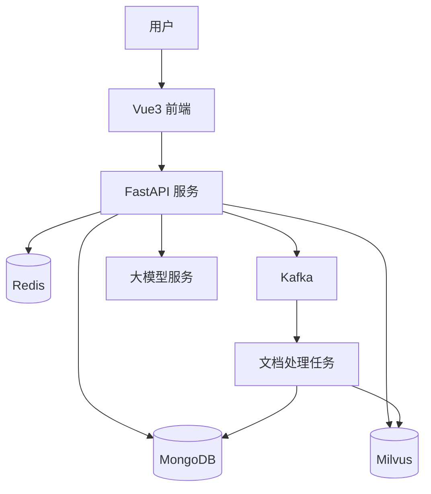
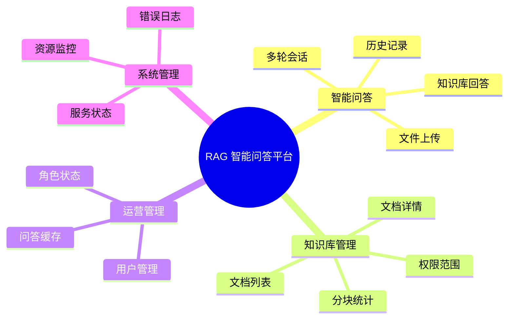
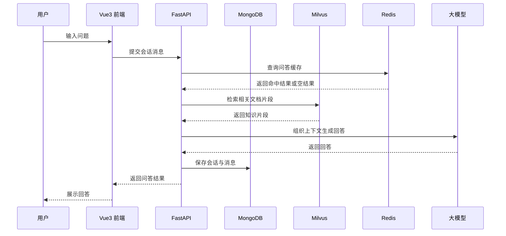

# RAG 智能问答平台

RAG 智能问答平台是一套面向企业知识库、内部制度问答、客服知识沉淀和文档检索的应用。系统包含登录、智能问答、文档管理、问答缓存、用户管理、系统监控和错误日志等功能，支持把业务资料整理成可查询、可追溯、可维护的知识服务。


## 技术栈

| 模块 | 技术 |
| --- | --- |
| 前端 | Vue 3、Vite、Pinia、Element Plus |
| 后端 | FastAPI、Beanie、Pydantic |
| 数据库 | MongoDB |
| 向量检索 | Milvus |
| 缓存 | Redis |
| 消息队列 | Kafka |
| 模型服务 | Ollama / DeepSeek / 智谱 API |
| 部署依赖 | Docker、Docker Compose |

## 系统架构图


```mermaid
flowchart TD
    U[用户] --> FE[Vue3 前端]
    FE --> API[FastAPI 服务]
    API --> Mongo[(MongoDB)]
    API --> Redis[(Redis)]
    API --> Milvus[(Milvus)]
    API --> Kafka[Kafka]
    Kafka --> Worker[文档处理任务]
    Worker --> Mongo
    Worker --> Milvus
    API --> LLM[大模型服务]
```

## 功能图


```mermaid
mindmap
  root((RAG 智能问答平台))
    智能问答
      多轮会话
      文件上传
      历史记录
      知识库回答
    知识库管理
      文档列表
      文档详情
      分块统计
      权限范围
    运营管理
      问答缓存
      用户管理
      角色状态
    系统管理
      资源监控
      错误日志
      服务状态
```

## 数据流图


```mermaid
sequenceDiagram
    participant User as 用户
    participant Web as Vue3 前端
    participant API as FastAPI
    participant DB as MongoDB
    participant VDB as Milvus
    participant Cache as Redis
    participant LLM as 大模型

    User->>Web: 输入问题
    Web->>API: 提交会话消息
    API->>Cache: 查询问答缓存
    Cache-->>API: 返回命中结果或空结果
    API->>VDB: 检索相关文档片段
    VDB-->>API: 返回知识片段
    API->>LLM: 组织上下文生成回答
    LLM-->>API: 返回回答
    API->>DB: 保存会话与消息
    API-->>Web: 返回问答结果
    Web-->>User: 展示回答
```

## 核心功能

- 智能问答：支持多轮会话、历史记录、文件上传和知识库回答。
- 文档管理：支持文档列表、处理状态、权限范围、分块数量和详情查看。
- 问答缓存：沉淀高频问题和标准答案，减少重复推理。
- 用户管理：支持用户查询、角色管理和状态管理。
- 系统监控：展示 CPU、内存、磁盘、数据库状态和运行指标。
- 错误日志：展示异常记录、告警信息和日志详情。

## 页面展示

### 1 登录页


支持昵称密码登录和验证码登录。

演示账号：

- 管理员：演示管理员 / Demo@123456
- 普通用户：业务咨询用户 / Demo@123456

---

### 2 智能问答


功能：

- 多轮会话
- 文件上传
- 历史记录
- 引用知识库回答

演示数据：

- 会话：3
- 消息：8

---

### 3 用户管理


支持：

- 用户查询
- 角色管理
- 状态管理

演示数据：

- 管理员
- 普通用户
- 知识库维护员
- 客服

---

### 4 文档管理


支持：

- 文档列表
- 处理状态
- 权限范围
- 分块统计

演示数据：

- 用户：4
- 文档：4
- 分块：12
- 会话：3
- 问答缓存：4

---

### 5 问答缓存


支持：

- 高频问题查看
- 标准答案管理
- 命中次数统计
- 审核状态展示

演示数据：

- 问答缓存：4
- 质量评估：4
- 评估样例：3

---

### 6 系统监控


支持：

- CPU 状态
- 内存状态
- 磁盘状态
- MongoDB 状态
- 服务运行指标

---

### 7 错误日志


支持：

- 日志列表
- 日期筛选
- 级别统计
- 详情展开

---

### 8 文档详情


支持：

- 基础信息查看
- 文档内容摘要
- 权限范围查看
- 处理状态查看

## 快速启动

### 1. 启动基础服务

```bash
docker start rag-mongodb rag-milvus rag-etcd rag-minio rag-redis kafka zookeeper
```

如果本地还没有容器，可以使用项目中的 Docker Compose 配置启动对应服务。

### 2. 安装后端依赖

```bash
pip install -r requirements.txt
```

### 3. 导入演示数据

```bash
python3 scripts/seed_demo_data.py
```

该命令会重建本地 `rag_platform` 数据库。

### 4. 启动后端

```bash
uvicorn main:app --host 127.0.0.1 --port 8001
```

后端地址：

```text
http://127.0.0.1:8001
```

### 5. 启动前端

```bash
cd web/plantform_vue
npm install
npm run dev
```

前端地址：

```text
http://127.0.0.1:5173
```

## 项目亮点

### RAG 检索增强问答

支持文档上传、分块、向量化检索和知识问答。

### 问答缓存

高频问题可以直接命中缓存，减少重复推理。

### 权限控制

支持管理员和普通用户角色隔离，文档也可以按权限范围管理。

### 监控与日志

提供系统运行监控和异常日志查看，方便观察服务状态。

### 管理后台

用户、文档、缓存、监控和日志集中管理，适合知识库长期维护。

## 目录结构

```text
api/                         后端接口
internal/                    后端业务模块
scripts/                     数据初始化脚本
docs/screenshots/            页面截图
web/plantform_vue/           Vue3 前端
Kafka/                       Kafka 配置
requirements.txt             Python 依赖
```
